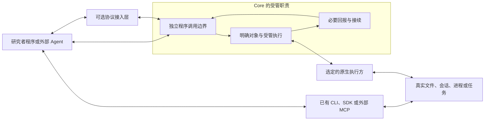

# Rho Core：目标架构

设计基线：2026-10-10。本文件定义目标职责，不声称已有新实现。选题与验收见
[Mission and plan](MISSION-AND-PLAN.md)，评审依据见 [Audit decisions](AUDIT-DECISIONS.md)。

## 一、Agent 如何工作，Core 为什么存在

Agent 在自己的运行环境中阅读文档与材料，选择方法，编写和组合代码，调用已有工具，
检查真实反馈并继续。新科研方法可以成为一段脚本或使用说明，不必先成为 Core 的新接口。
研究者和普通程序也能独立使用同样的底层能力。

只有一个动作确实需要跨等待者持有运行、稳定定位原生对象、保护重复送达或找回回报，
而现有工具无法满足该需要时，才选择 Rho 的受管路径。Core 为这部分工作提供必要的
执行底座；Agent 的整个工作环境无需经过它。

图中直接工具、协议接入层和原生执行方均在 Core 逻辑边界之外。它们可以共用仓库或
进程；图不要求新仓库、微服务、插件框架或独立数据库。执行方也可能是维护中的
现成工具；若它已提供所需执行和接续能力，应复用它，避免再造一套管理系统。

## 二、核心职责：做什么、为什么、如何做到

- **1. 提供可独立使用的程序调用边界**
  - **做什么**：让调用方直接使用 Core 自己承担的受管能力，传递明确对象、参数和调用范围，取得真实回报。
  - **为什么**：新增客户端、模型或分析方法不应持续改变核心语义。
  - **如何**：先服务一个实际调用方，用普通函数或必要的程序接口实现；说明、类型和示例按需读取。参数检查服务具体动作，不解释研究意图。
  - **边界**：不汇总整个工具生态，不要求调用方先走统一发现目录，不为每个领域函数设计入口。
- **2. 持有需要管理的对象与执行**
  - **做什么**：定位选定执行方及其真实对象，受理明确动作，使运行寿命与某个等待者分离。
  - **为什么**：持久会话、长计算与丢失回报需要可定位的执行事实，不能依赖模型猜测。
  - **如何**：保留必要对象关联与请求身份，调用执行方，读取其原生句柄和状态。可变原生条件在实际执行处检查。
  - **边界**：不统一所有语言对象，不自动发现或启动科学环境，不代替原生 Owner 管理语言状态。
- **3. 提供必要回报与接续**
  - **做什么**：让调用方找到原请求、已知状态、结果或结果入口，以及无法确认的部分。
  - **为什么**：断线、进程中断和存储失败后仍需继续工作，并避免误把未知当成功或自动重跑。
  - **如何**：按选定动作保留最小记录，复用原生查询、重连和取消能力；大结果在执行环境中处理，按需取回有界材料。
  - **边界**：不记录所有查询、模型对话或环境副作用，不建设全局恢复、回滚与科研证据账本。

这是需要时承担的逻辑职责，不能据此预建三个子系统。契约、类型和存储选择由首个
受管流程决定；共享机制必须解决可证明的缺口，不以固定流程数量或未来扩展为依据。

## 三、核心之外的责任

| 位置 | 承担什么 | 与 Core 的关系 |
| --- | --- | --- |
| Agent 运行环境 | 模型循环、文档读取、工具选择、代码组合、中间数据处理、上下文与停止策略 | 可以直接使用已有工具，也可以调用 Core；Core 不嵌入模型或编排器 |
| 可选协议接入层 | 命令行表达、协议消息、版本、连接、认证与传输限制 | 依赖 Core 程序边界；Core 不依赖协议类型或客户端特性 |
| 原生执行方与领域 Owner | 文件读写、语言会话、计算资源、原生条件与结果语义 | 为选定受管动作提供必要调用与状态；已有原生接口优先复用 |
| 应用装配 | 选择组件、接入方式与用户界面 | 按实际消费者组合；不要求所有外部能力统一注册到 Rho |

CLI 是命令行界面，MCP 是应用协议，HTTP 是可用的传输方式，不能作为三组必建
核心模块。需要接入时复用维护中的协议实现，映射 Core 已有能力，避免逐项包装
科研方法。协议进程可与 Core 同进程，依赖方向仍然不变。

认证可以发生在接入层，但 Core 负责的调用范围、身份绑定和对象访问约束在直接
程序调用时仍成立；原生 Owner 的执行条件也不能被另一入口绕开。这里的边界分离
是依赖规则，不是取消实际检查或增加一套逐层审批。

## 四、何时进入受管路径

| 动作 | 优先方式 | Core 增加价值的条件 |
| --- | --- | --- |
| 阅读文件、搜索材料、修改脚本 | 已有文件工具、编辑工具与 Git | 存在它们无法满足的具体对象或持续执行需求；单纯统一入口不构成理由 |
| 使用 CLI、SDK 或外部 MCP 服务 | Agent 环境直接使用原接口与文档 | 确需 Rho 持有动作、保护重复送达或接续结果，且原工具尚未提供 |
| 尝试新的统计方法 | 阅读方法与包文档，编写分析代码 | 通常无需改 Core；重复出现的原生执行问题由实际 Owner 处理 |
| 对持久 R 会话提交代码 | 经选定 Owner 定位会话并执行 | Core 可以持有受理与回报；会话身份、忙碌与语言状态由 R Owner 判断 |

一个脚本可以组合多次调用，但每个受管动作只对自己声明的受理和效果负责。
代码组合不自动获得跨调用事务、整体重试或回滚；脚本部分执行后，不能因后续失败
自动重跑整个脚本。执行语义必须由实际工具说明，必要时使用已有的事务能力。

Core 的保证只覆盖它受理且契约声明保护的动作，保留期限和进程寿命范围也要说明。
Agent 在外部 shell 直接改了文件，Core 可以再次观察当前内容，但不能补造受理记录、
宣称保护过该修改或推断其因果。共享原生资源发生外部变化时，由 Owner 按当前
身份、版本与执行条件判断可否继续；Core 的锁或记录不自动约束外部工具。

## 五、受管动作的执行事实

1. 调用方已选动作、执行方和对象；Core 接收实际参数与已成立的调用范围。
2. 执行各自必要的结构、身份与范围检查；原生 Owner 在真正操作时检查可变前提。
3. 对声明有重复送达保护的动作，先保存请求身份与受理信息；保存失败不派发。
4. 派发该动作并持有必要关联；某个等待者结束不自动取消原执行。
5. 提供已知结果或结果入口；派发、原生效果与回报保存的未知分别表达。

请求身份限定在选定项目与稳定调用方范围，绑定实际执行方、能力、对象与参数。
调用方代持身份：同身份同请求找回原受理；同身份不同请求拒绝；有意再执行用新身份。
原生提交本身若支持去重则复用；若无法确认派发或效果，不因超时、重连、重启或
代码相似度再次提交，也不承诺外部 exactly-once。

受理记录不与原生副作用形成分布式事务。Core 预检查不能消除 TOCTOU；文件写入的
并发保证由实际 Owner 说明，Git 历史或一次哈希检查不自动提供原子比较后写入。
读取新状态可以帮助继续，却不能证明旧动作完成或改写原请求历史。

## 六、结果、保留与继续

结果保留原生语义，增加理解当前调用所需的来源、范围与限制，不强迫所有外部工具
转换成统一结果模型。空、部分、缓存、忙碌和不可用能够区分；时间或来源未知时
明确未知。中间数据可留在已有执行环境中，用代码过滤和汇总，避免全量进入上下文。
大结果提供明确上限与续读方式；历史续读校验原生身份，不拿当前字节冒充旧输入。
普通读取不自动记账，也不为读取而启动或恢复运行时。

| 情况 | 表达的事实 | 允许怎样继续 |
| --- | --- | --- |
| 长动作仍在运行 | 原执行身份、原生关联、已知状态和输出入口 | 观察原执行或请求取消 |
| 等待者丢失 | 受理和执行未因等待结束而撤销 | 找回原执行；不重新提交 |
| 派发后 Core 中断 | 原记录与可确认的原生事实；不能确认的部分保持未知 | 查询已有任务；不能恢复时说明限制 |
| 原生完成但回报保存失败 | 已知完成事实与回报缺失分别表达 | 能取回材料才补存；不重新执行以制造回报 |
| 取消或释放未确认 | 请求已发出，停止或释放尚未确认 | 定位并观察对应资源；不误报停止或回滚 |

补存已有回报、连接原生已有任务和重新执行是不同动作。结果未知只影响实际依赖的
资源与后续动作，无关读取可以继续；不建设统一 Recovery Manager 或全项目冻结机制。

仅为所选接续保证保留项目与调用范围、请求身份、实际参数、对象与执行方关联、
已知状态、原生句柄、结果入口及必要错误。确切字节只在真实复核或续读用途需要时
保存。使用成熟存储，其原子性和持久性通过故障实验验证；不预建 Event Sourcing、
Outbox 或变化总账。受理与派发之间的崩溃窗口必须诚实表达。

保留期限、容量、删除与过期身份行为属于契约。只在记录仍存在时去重却允许旧身份
过期后悄悄变成新动作，会破坏承诺；实现须明确拒绝过期、保留识别信息或声明可验证
的有效期。清理保护运行中及仍被引用的材料；容量不足时采取公开的拒绝或受限行为。

## 七、执行环境与扩张约束

首版选择单用户本地环境，复用用户选定的执行方。外部 Agent 的代码执行环境负责
自己实际提供的进程、文件、网络与资源边界；Core 只限制自己拥有的请求、等待、
输出与记录资源。若 Core 启动或持有进程，也必须为那部分资源建立实际控制。
任意代码执行可使用 OS 权限，路径检查不能宣称为沙箱。网络接入的认证、暴露与
传输限额由接入层落实，Core 与 Owner 仍执行自身约束。授权已成立的工作不再审批。

增加机制前先检验：换客户端、换模型或增加分析方法是否被迫改 Core；已有工具是否
已经解决问题；新契约到底提供什么新增保证。专用工具与代码组合按任务结果选择，
不预设“一项方法一个工具”或“全部压成万能 execute”。Core 不管理提示、隐藏思维链、
向量记忆、图调度、编辑器缓冲区、应用布局与科学结论，也不保证全环境副作用可追踪。

## 八、实施必须守住的核心原则

1. **真实任务决定新增职责**：先试原工具，说明可复现缺口；新增机制必须带来可验收的受管保证。
2. **调用方选行动，实际 Owner 判断原生事实**：Core 接收已选动作，不解释科学意图；可变条件在实际操作处检查。
3. **已有能力优先复用**：使用原文档、接口、句柄与维护中的工具；代码组合或专用工具由实际任务选择。
4. **核心保持独立**：程序边界可直接使用；协议接入依赖 Core，领域语义由 Owner 承担；三项职责不预定三套子系统。
5. **必要核心信息可按需取得**：调用方在其范围内能取得能力说明、原请求、对象与执行关联、已知事实、未知原因、结果入口和保证限制。记录缺失或读取失败也明确表达，不以统一目录或全量上下文注入实现披露。
6. **受理、效果与回报分别表达**：等待结束不撤销执行，未知不授权重跑；代码组合不产生事务，取消不等于回滚。
7. **保证与成本都有范围**：公开动作、进程寿命、保留期限、容量、访问与超限行为；执行记录服务接续，外部行为不补造因果。
8. **工程反馈持续进入契约**：真实失败形成最小复现和回归，契约、示例与实现同步；Agent 可提出改进，实际效果由确定性检查与领域复核确认。

这些原则约束首个流程的实现与后续扩张。所需信息、开工清单、定向故障实验与
CI 触发范围见 [工程实践指南](ENGINEERING.md)。观测与测试由各自 Owner 建设，
不以“持续迭代”为理由将模型评估、部署控制或全环境遥测加入 Core。
