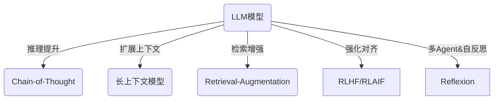
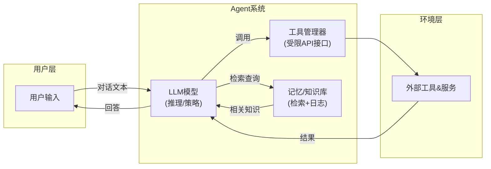

# 用户原始审核报告

用户提供的设计审核输入，保存于 2026-10-09。下方是阅读副本，仅整理行尾空格并
修正 Mermaid 标签的引号与换行语法；[原始文本](USER-REPORT.txt)逐字节保留。报告未逐条核实，
其中关于当前实现、研究效果、性能和安全的主张不自动成为本项目事实。
项目采用与修正的判断见 [审核报告取舍](../AUDIT-DECISIONS.md)。

---

# 执行摘要
本报告对用户提供的多模块智能体设计进行前沿评估，发现其中部分模块设计冗余复杂，未紧跟当前语言模型(agentic LLM)研究进展。我们对比了主流Agent架构（ReAct、LangChain、AutoGPT等）与该设计，梳理出各模块功能及替代方案；基于最新论文评估了设计假设的能力与局限；归纳了现代Agent设计原则并评估各模块合规性；从基础设施视角对查询快照、操作网关等提出轻量化替代；设计了多组实验验证模块价值；分析了滥用、偏见等风险并提出监控措施。最后给出简化后可行架构草图和六点改进建议。

## 1. 架构模块对比
下表比较设计中的典型模块与主流Agent架构对应关系：

| 模块        | 功能描述                          | 与主流架构对比                                                 | 冗余/复杂？    | 现代替代方案                           | 优点                                        | 缺点                                        |
|-------------|-----------------------------------|---------------------------------------------------------------|---------------|-----------------------------------------|---------------------------------------------|---------------------------------------------|
| QuerySnapshot（查询快照） | 捕获当前查询或环境状态快照          | 类似于对话上下文管理，但独立设计偏冗长；主流Agent往往仅用**记忆/对话历史**和“状态”传递上下文 | 冗余         | **内嵌对话上下文或长期记忆**（如向量数据库或区块日志） | 有助于审计（可记录状态变化）                | 单独模块增加复杂度，重复模型已有上下文能力；延迟增加          |
| OperationGateway（操作网关） | 对接外部工具/服务的调用网关        | 等同于LangChain等框架中的**工具管理器**，但传统实现常为轻量工具调用逻辑 | 过于繁琐    | **统一工具接口抽象**（LangChain工具模式）、轻量插件调用 | 可集中控制权限和缓存调用结果                | 网络调用开销大；实现复杂度高；可能成为单点瓶颈               |
| Memory/Knowledge Store（记忆/知识库） | 存储长期/外部知识            | 现代Agent多用检索增强生成（RAG），使用向量数据库加会话历史传递上下文 | 若独立未封装则复杂 | **向量检索+实时摘要**（像MemAgent）                 | 持久化知识，支持多轮任务                    | 如果按日志式设计需复杂回滚机制；否则易出错         |
| PromptGenerator（提示生成） | 根据任务动态构造Prompt          | 与LangChain中的**Prompt模板**相似；AutoGPT等通过简单函数生成，大多简单模块化 | 不必要      | 模板化Prompt或**模型内生成**（链式思考直接输出）         | 灵活构造多样化提示                    | 额外复杂的模块化代码增加维护成本，易重复模型生成能力        |
| Agent Planner（任务规划） | 将高层目标分解为子任务            | 主流系统往往交给LLM自身策略（Chain-of-Thought）或外部Planner（如Tree-of-Thoughts） | 重复         | **链式思考(RAG/反射)**           | 可解释的任务分解过程                  | 单独模块不如端到端Prompt高效；固定规划难覆盖所有用例         |
| 多Agent协调       | 多子agent或子系统的调度与协作     | 如AutoGen、CrewAI等采用Router或黑板架构，但实践多先以单agent加工具为主 | 依需      | 简化为**单Agent+工具**，或使用LangChain **Router**模式 | 支持复杂任务和模块复用             | 额外开销大；分布式调试复杂；过多反而产生协同成本         |

以上对比显示：现代Agent多采用**模型+工具+记忆+循环**的简洁模块化体系，过细或冗余的自定义模块可被集成式方案替代。例如，查询快照可用对话历史和外部记忆库代替，操作网关可由通用工具抽象代替。ReAct等框架将“思考-行动”循环融于Prompt中，无需独立计划模块。训练方案亦倾向结合监督与RL（如RLHF、RLAIF）优化模型对齐。

## 2. 能力与局限
基于“知识、记忆、可引导性、下一个标记预测”等光谱，我们评估设计假设：

- **知识范围与检索**：LLM自带庞大知识但有更新时间截点，容易“幻觉”（confidently生成错误信息）。因此设计中若假定模型可自发提供精准事实是过时的。目前常用检索增强生成（RAG）技术以外部知识库补充最新信息。相关研究显示，无检索的单模型易受幻觉、偏见影响；Memory Agent等长文处理方法可显著拓展上下文利用。
- **工作记忆（上下文窗口）**：早期假设LLM只能处理几千token，大型记忆模块成为必需。但最新模型上下文扩展到数万乃至数十万token，MemAgent能处理数百万长度文本，显著改变记忆需求。因此，冗长的记忆架构（如频繁存取外部DB）可简化。设计如依赖固定快照机制，可能低估了上下文内联容量提升带来的改进。
- **可引导性与培训**：设计若假设模型无法根据策略或偏好调整，应采用RLHF或RLAIF等强化对齐技术。最新研究表明RLAIF使用模型自标记可近似RLHF效果，值得在设计中考虑。过度依赖静态“系统规则”可能导致过度谨慎或偏差，正如RLHF系统常出现“过度谨慎”问题。对话式引导和反思（如Chain-of-Thought、自我修正）已被证明可提升模型推理和一致性。
- **下一标记预测模型局限**：基础假设是LLM只能做表层预测。研究表明，通过链式思考、多轮反馈（如Reflexion）等可有效提高推理质量。此外，Prompt敏感性问题仍存，设计中应避免固定模板的脆弱性。
- **总结**：设计中若基于LLM能力的过时假设（如短上下文、无记忆、无检索），则与现代成果冲突；相反，许多假设（如需工具调用）得到新研究支持（ReAct框架强调“思考-行动”循环）。我们用简图或要点总结能力谱支持与挑战：

**图：** 现代方法（箭头）显著扩展了基础LLM能力（中心），如链式思考、长上下文、检索增强和自我反思。相对地，设计中若假设LLM固有限制，则需与现成果对齐。

## 3. Agent设计原则
现代Agent设计强调**模块化、可验证、最小权限、可解释、回滚能力、低延迟**等原则。下列原则摘自NVIDIA等业界意见：

- **可组合性/模块化**：鼓励可复用组件（模型、工具、记忆等）；
- **可验证性/可观测性**：设计应留有审计轨迹，策略要可验证；
- **最小权限**：Agent只能调用必要工具/资源，避免过度授权；
- **可解释性**：推理过程应透明（如显示思考过程），防止“黑箱”；
- **可回滚/Audit**：支持错误恢复和回滚，需要持久化记录（如Ledger视图）；
- **低延迟交互**：避免额外不必要的消息往返；优先本地或内联调用；

下表评估设计各模块是否满足上述原则，并给出改进建议：

| 模块           | 组成是否可组合 | 可验证/可审计 | 最小权限 | 可解释性 | 可回滚 | 低延迟 | 改进建议                         |
|--------------|--------------|--------------|---------|--------|-------|------|-------------------------------|
| QuerySnapshot |    较低      |  依赖设计    |   -     |   中   | 依赖改进 | 低：需额外请求 | 可用所述“账本+视图”设计；减少无谓快照调用        |
| OperationGateway |  中      |  条件可验证  | **差**：常赋予全部工具权限 | 低     | 无   | 较低（网络开销）| 统一最小权限政策；可考虑内联轻量实现            |
| Memory Store  |    高      |  借助原理    | 可控制  |   低   | 高     | 中   | 引入可审计日志（Ledger）；使用向量索引加速检索  |
| PromptGenerator | 高      |  低          |  -     | 中-高  | 低   | 高   | 多用可解释模板；避免隐藏逻辑                       |
| Agent Planner |   中高      |  低          |  -     | 中    | 低   | 中   | 更倾向链式思考，不另设模块         |

### 4. 基础设施视角
从扩展性、维护复杂度、成本、安全、延迟/吞吐角度评估：

- **扩展性与维护**：过多微服务模块（如OperationGateway）会导致系统碎片化、运维成本高。统一轻量框架（如LangChain）或Serverless函数可减轻维护负担。
- **性能成本**：网络中转或重复数据存储（QuerySnapshot、OperationGateway）增加延迟。可替代为**事件驱动流水线**，仅在需要时调用模型和工具。内嵌（in-model）工具调用（如GPT内置代码执行）可消除外部延迟。
- **可伸缩性**：集中式数据库或服务节点可成瓶颈；建议使用弹性云服务（Vector DB、Serverless计算）或分布式事件流。
- **安全**：如NVIDIA提出，必须零信任隔离Agent进程。OperationGateway等接口若权限过大容易被滥用。可用统一授权层（如OpenShell）限制模块操作范围。避免存储敏感信息，防止记忆投毒。给出了Prompt注入、数据外泄、权限滥用等68种风险模式。
- **延迟与吞吐**：简化中间件，减少往返调用数可提高吞吐。可将某些同步模块变异步处理，如采用批量查询、异步发布-订阅事件。

下表列出了模块及其现代替代方案的基础设施实现对比：

| 模块         | 当前实现              | 问题                    | 替代方案                           | 影响                                         |
|-------------|----------------------|-------------------------|------------------------------------|----------------------------------------------|
| QuerySnapshot | 专用DB+接口           | 高延迟、管理开销大       | 内嵌LLM上下文 + 向量检索     | 节省网络调用；依托向量数据库扩展性好                |
| OperationGateway | 微服务+权限管理层   | 权限过宽、单点瓶颈       | LangChain工具框架 + Sandboxing | 使用细粒度API；权限受控，避免数据泄露              |
| Memory Store | 本地或外部存储       | 容量与一致性问题         | Event Ledger + 多视图       | 提高审计与回滚性；可扩展成分布式索引               |
| Prompt 工具  | 独立服务/脚本        | 重复造轮子、不易调试     | 模板库+Prompt管理模块       | 可集中优化提示策略；便于版本管理                   |

### 5. 实验与验证建议
为评估各模块价值，可设计多组对照实验：

| 实验方案            | 数据集/场景              | 对照组            | 指标                        | 资源成本  | 时间成本  | 成功判据               |
|---------------------|------------------------|------------------|----------------------------|----------|----------|------------------------|
| **模块消融测试**：移除/替换单个模块（如关闭QuerySnapshot） | Q&A或信息检索任务集合  | 完整系统或简化版本 | 任务成功率、回答准确性     | 中等     | 中等     | 精简系统性能不下降或仅轻微下降 |
| **延迟/吞吐对比**：模拟高并发调用 | 合成/公开文本流        | 现有设计 vs 轻量化流水线 | 平均响应延迟、并发吞吐量 | 低      | 低       | 简化方案显著降低延迟，提高吞吐 |
| **多轮对话持久性**：长期对话链测试   | 漫长任务对话日志      | 有/无记忆存储    | 记忆调用次数、信息保持率   | 低      | 低       | 增强记忆方案更少遗忘关键上下文 |
| **安全攻击模拟**：提示注入与越权尝试 | 典型恶意输入场景      | 不安全 vs 安全方案 | 漏洞检测率、安全策略有效性 | 高      | 中       | 安全方案抵御大部分注入攻击 |

- **成本估计**：实验成本分为低（单机测试），中（多机小规模评估），高（大规模在线试验）。例如“延迟对比”可用模拟器低成本完成，而大规模上线测试高成本。
- **成功判据**：性能不显著下降（可容忍5%以内的损失），安全事件减少（如注入漏洞拦截率>90%）等为判断标准。

### 6. 风险与伦理
潜在风险及缓解措施包括：
- **越权执行**：Agent可能调用未经授权的命令或数据。应严格**最小权限**原则，采用外部策略控制（如OpenShell），并实时监控行为日志。监控指标：访问次数、执行命令类型异常、策略违规率。
- **Prompt注入与数据外泄**：恶意Prompt或注入技能可能诱导Agent泄露敏感数据。应对策：在引擎侧进行输入输出过滤，SkillSpector扫描技能代码。监测指标：敏感关键词触发率、非授权数据访问尝试。
- **偏见与不当输出**：LLM固有偏见可能造成不公平或有害结果。需通过持续测试（指标：输出安全性评估）以及反馈机制（如多模型评估）降低偏见影响。
- **记忆投毒**：长期记忆中插入虚假信息可误导Agent。可定期审计记忆日志（Raw Ledger）并使用数据完整性检查。监控指标：知识库一致性检查失败率。
- **自主漂移**：如NVIDIA所述，长期自主运行可出现“偏离”。缓解：加入外部卫兵进程，定期强制审查当前目标，监控“行为漂移”迹象。
- **滥用与安全**：提供恶意使用接口的风险（如用于生成有害内容）。措施：流量审核、行为评分（LLM-as-judge）、或预定义安全框架（Anthropic绝对安全AI原则）。

## 精简后的建议架构草图
综合以上分析，建议采用简化的单Agent架构：前端对话接口→LLM模型（含链式思考Prompt）→统一**工具接口模块**（ToolManager，受限权限）→**记忆/知识模块**（向量检索+可审计日志）→反馈回LLM。整体仅保留必要组件，删除冗余快照/网关，将安全控制放在工具层和运行环境外部。此架构可用Mermaid表示如下：

图：简化后的单Agent架构。模型（LLM）负责控制流程，调用受限工具和记忆检索。所有操作记录于日志，可实现审计和回滚。硬件/执行层面采用隔离运行环境和最小权限策略。

## 结论与改进建议
针对评估结果，提出以下六点具体改进建议（每条一句）：
- **合并QuerySnapshot与对话上下文管理**：利用内联上下文窗口与向量检索替代独立快照存储，实现更高效的记忆调用。
- **统一工具访问**：将OperationGateway简化为统一的Tools管理层，应用细粒度权限控制和沙箱执行（如NVIDIA OpenShell）。
- **引入现代记忆结构**：采用“原始账本+派生视图+策略”架构，确保记忆可审计、可回滚，并通过向量索引提高检索性能。
- **端到端链式推理**：鼓励使用ReAct等链式思考Prompt替代独立的计划器模块，使模型自主决定下一步动作。
- **简化中间件层**：移除多余消息队列/微服务，将部分同步操作异步化，降低延迟并方便扩展。
- **强化安全监控**：在设计中集成静态分析（如SkillSpector）和动态审计，实时检测提示注入、越权等风险并自动触发报警。

以上改进可使设计更符合前沿Agent原则和实践，大幅降低复杂度和安全风险，提高性能和可靠性。
